# Probability and Statistics Fundamentals
This repository is my notes  key concepts in probability and statistics, based on Prof. Massimo Piccardi's course 31256/42177 Image Processing and Pattern Recognition. These principles are foundational for statistical pattern recognition and machine learning.

# Agenda
1. Random variables: categorical and numerical
2. Mean and variance
3. Sample mean, sample covariance
4. The Gaussian distribution
5. Multivariate random variables
6. The covariance matrix
7. The multivariate Gaussian distribution
8. Fitting the lot: parameter estimation


# 1. Random Variables

- **Definition**: A variable whose outcome is determined by a random event.
- **Types**: Categorical (finite outcomes) and numerical (infinite outcomes).

## 1.1 Categorical Random Variables

- **Example**: 'Country' with five possible values: Italy, Australia, China, Spain, New Zealand.
- **Probabilities**:

| Country      | Probability |
| ------------ | ----------- |
| Italy        | 0.18        |
| Australia    | 0.25        |
| China        | 0.38        |
| Spain        | 0.10        |
| New Zealand  | 0.09        |

### Probability Mass Function (PMF)

- **Definition**: Maps each outcome of a discrete variable to its probability.
- **Properties**:
  - All probabilities are non-negative.
  - Sum of all probabilities is 1.

Example: Country PMF

- **Non-negative**: All listed probabilities are ≥ 0.
- **Sum to One**: \(0.18 + 0.25 + 0.38 + 0.10 + 0.09 = 1\)

[Notebook with Plots](./src/1.1.probability_mass_function_country.ipynb)

```python
# Import libraries
import matplotlib.pyplot as plt
import numpy as np

# Initialize data
countries = ['Italy', 'Australia', 'China', 'Spain', 'New Zealand']
probabilities = [0.18, 0.25, 0.38, 0.10, 0.09]

# Create figure and subplots
fig, axs = plt.subplots(1, 2, figsize=(16, 6))

# Bar chart: PMF
axs[0].bar(countries, probabilities, color='green')
axs[0].set(xlabel='Countries', ylabel='Probability', title='Country PMF')
axs[0].set_xticklabels(countries, rotation=45)
axs[0].set_ylim([0, 0.5])

# Pie chart: Probabilities
axs[1].pie(probabilities, labels=countries, autopct='%1.2f%%', startangle=90)
axs[1].set_title('Country Probability Pie Chart')
axs[1].axis('equal')

# Show plots
plt.show()
```


## 1.2 Numerical Random Variables

- **Definition**: A variable whose outcomes can take any number in a range.
- **Types**: Continuous (infinite outcomes in an interval) and discrete (countable outcomes).
  
Examples

- **Continuous**: Height of a person, weight of a person, intensity of a pixel in an image.
- **Discrete**: Number of employees in a company, scores on a test.

### Probability Density Function (PDF)

- **Definition**: The function assigning a probability value to each of the numerical values. The pdf of a continuous random variable, p(x), (if it exists) gives us the density of probability in x

- **Properties**: 
  - $( p(x) \geq 0 $) for all $( x $)
  - The area under the curve is 1.

Notation

- $( p(x) $) denotes the probability density of any value of $( x $).

```python
import matplotlib.pyplot as plt
import numpy as np
from scipy.stats import norm

# Generate the x values: from -2 to 2 in steps of 0.1
x = np.arange(-2, 2.1, 0.1)

# Compute the pdf of a normal distribution with mean 0 and std 0.25
pdf_values = norm.pdf(x, 0, 0.25)

# Create the plot
plt.plot(x, pdf_values)
plt.title('Gaussian PDF with mean 0 and std 0.25')
plt.xlabel('x')
plt.ylabel('pdf(x)')
plt.show()
```
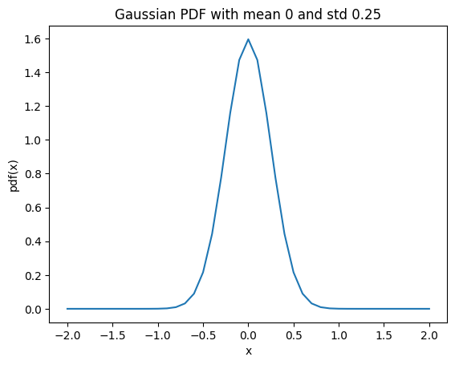


The so-called “random” numbers differ in their probability distributions!. for example: 

Gaussian Distribution: The plot shows 100 samples from a Gaussian distribution with mean 0 and standard deviation 2. You can see the classic "bell curve" shape.

```python
# Generate 100 samples from a Gaussian (Normal) distribution with mean 0 and standard deviation 2
X_normal = np.random.normal(0, 2, (100, 1))

# Create subplots
fig, axs = plt.subplots(1, 1, figsize=(18, 6))

# Plot Gaussian distribution
plt.hist(X_normal, bins=20, color='blue', edgecolor='black', alpha=0.7)
plt.title('Gaussian Distribution')  # Updated this line
plt.xlabel('x')  # Updated this line
plt.ylabel('Frequency')  # Updated this line

# Show plots
plt.show()
```


Uniform Distribution: The plot shows 100 samples from a uniform distribution between 0 and 2. The frequency of each bin should be roughly equal, given that the distribution is uniform.

```python
X_uniform = np.random.uniform(0, 2, (100, 1))

# Plot Uniform distribution
plt.hist(X_uniform, bins=20, color='green', edgecolor='black', alpha=0.7)
plt.title('Uniform Distribution')
plt.xlabel('x')
plt.ylabel('Frequency')

# Show plots
plt.show()
```
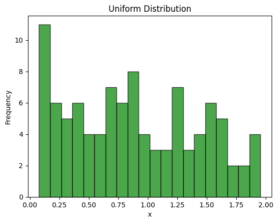

Student's t-Distribution: The third plot shows 100 samples from a Student's t-distribution with 1.5 degrees of freedom, a location of 0, and a scale of 2. The distribution is somewhat similar to the Gaussian distribution but has heavier tails.

```python
df = 1.5  # degrees of freedom
loc = 0  # location
scale = 2  # scale

X_t = t.rvs(df, loc, scale, size=(100, 1))

# Plot Student's t-distribution
plt.hist(X_t, bins=20, color='red', edgecolor='black', alpha=0.7)
plt.title("Student's t-Distribution")
plt.xlabel('x')
plt.ylabel('Frequency')

# Show plots
plt.show()
```
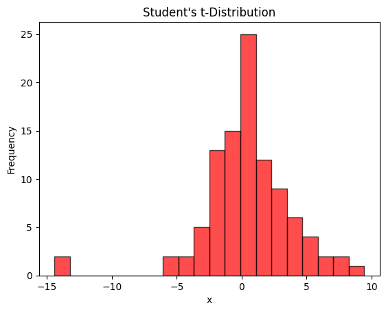

## 2. Mean and Variance
The pdf of a continuous random variable describes its probability distribution fully. However, sometimes it's more convenient to summarize the distribution using a few key statistics:

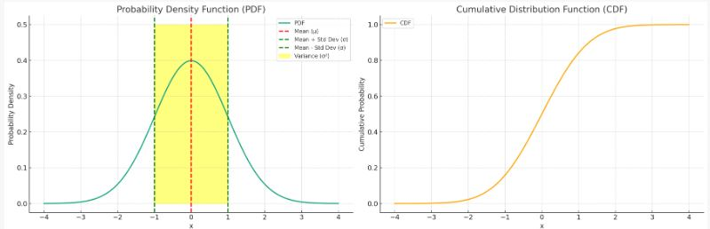

##### Mean
The mean ($( \mu $)) is the weighted average value of the random variable, where the weights are given by the probability density function (pdf). 

##### Variance
The Variance ($( \sigma^2 $)) quantifies the “dispersion” of the values around the mean.

##### Standard Deviation
The standard deviation ($( \sigma $)) is just its square root and is in the same scale as the random variables values.

These summary statistics can be computed exactly using integrals.


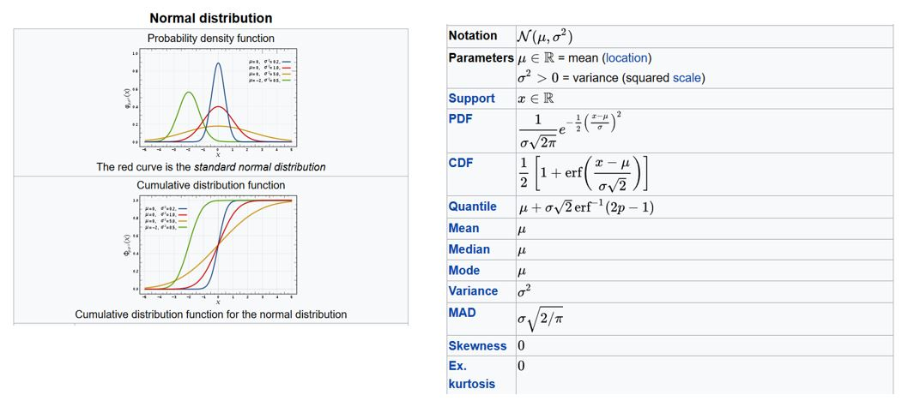


##### Approximating Mean and Variance

Often, the probability density function $( p(x) $) may not be available or the integrals required for exact calculations are not easy to compute. In such cases, it's common to approximate the statistical properties using a set of samples.

Assuming a set of samples $( x_i $), where $( i = 1, 2, \ldots, N $) are available, we can approximate the mean $( \mu $) and the variance $( \sigma^2 $) as follows:

###### Approximating the Mean

The mean $( \mu $) can be approximated as the average of the samples:

$[
\mu \approx \frac{1}{N} \sum_{i=1}^{N} x_i
$]

###### Approximating the Variance

The variance $( \sigma^2 $) can be approximated as:

$[
\sigma^2 \approx \frac{1}{N} \sum_{i=1}^{N} (x_i - \mu)^2
$]

Here, $( \mu $) is the approximated mean as calculated above.

#### 3. Sample mean, sample covariance
```python
import numpy as np
import matplotlib.pyplot as plt

# Generate 20 random samples from a standard normal distribution (mean=0, std=1)
X = np.random.randn(20, 1)

# Plot the samples on the screen
plt.plot(X, np.ones(20), 'o')
plt.xlabel('Sample Value')
plt.ylabel('Y=1')
plt.title('Random Samples Plot')
plt.show()

# Compute the sample mean
mu = np.mean(X)

# Compute the sample variance
sigma_2 = np.var(X)

# Compute the standard deviation
sigma = np.sqrt(sigma_2)

print(f"Sample mean: {mu}")
print(f"Sample variance: {sigma_2}")
print(f"Standard deviation: {sigma}")

```
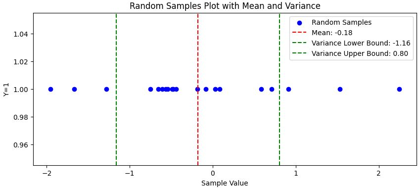

## 4. The Gaussian Distribution

The Gaussian distribution, also known as the normal distribution, has many favorable properties that make it a popular choice for data modeling in various fields including statistics, finance, and machine learning.

#### Analytical Form of the PDF

The Probability Density Function (PDF) of the Gaussian distribution is given by the following formula:

$[
p(x) = \frac{1}{\sigma \sqrt{2 \pi}} e^{-\frac{1}{2} \left(\frac{x - \mu}{\sigma}\right)^2}
$]

Here, the distribution is completely determined by two parameters:
- $( \mu $): The mean of the distribution
- $( \sigma^2 $): The variance of the distribution

The mean $( \mu $) indicates where the peak of the distribution occurs, and the variance $( \sigma^2 $) indicates the spread or width of the distribution.

## 5. Multivariate Random Variables

Often, we encounter situations where multiple random variables are associated with the same object. In such cases, it becomes convenient to consider these variables together as a single set. This set is referred to as a **random vector** or **multivariate random variable**, depending on the context.


Examples could include:

- The dimensions of an object, represented as (length, width, depth).
- The pixels of an image, represented as (pixel1, pixel2, ..., pixelN).
- The color channels of a pixel, represented as (R, G, B).


We can denote the individual variables as $( x_i $), where $( i = 1, 2, ..., D $), and the entire multivariate random variable can be represented as $( \mathbf{X} = [x_1, x_2, ..., x_D]^T $).


Therefore, the probability of all these variables, $( p(x_1, x_2, ..., x_D) $), can be noted more compactly as $( p(\mathbf{X}) $).


The next section will discuss what happens to the mean and variance when dealing with multivariate random variables.

#### Mean of a Multivariate Variable

The mean of a multivariate variable is an extension of the concept of the mean of a single variable.


Given $( D $) individual variables, the mean of each individual variable is calculated. These means are then "packed together" into a $( D \times 1 $) vector.

$[
\mu = [\mu_1, \mu_2, ..., \mu_D]^T
$]

In this notation, $( \mu $) is the vector that contains the means of each individual variable $( x_i $) for $( i = 1, 2, ..., D $).

## 6. Covariance Matrix or (Co)variance of a Multivariate Variable

The concept of variance extends to multivariate random variables but becomes more intricate.

Recall that variance measures the "dispersion" of values around the mean for a univariate random variable. In the multivariate setting, we are interested in how each pair of individual variables co-varies around their means.

For a multivariate variable with $( D $) individual variables, the covariance is represented as a $( D \times D $) matrix.

$[
\text{Cov}(\mathbf{X}) = \begin{pmatrix}
\text{cov}(x_1, x_1) & \text{cov}(x_1, x_2) & \cdots & \text{cov}(x_1, x_D) \\
\text{cov}(x_2, x_1) & \text{cov}(x_2, x_2) & \cdots & \text{cov}(x_2, x_D) \\
\vdots & \vdots & \ddots & \vdots \\
\text{cov}(x_D, x_1) & \text{cov}(x_D, x_2) & \cdots & \text{cov}(x_D, x_D)
\end{pmatrix}
$]

Each entry $( \text{cov}(x_i, x_j) $) measures how much $( x_i $) and $( x_j $) co-vary around their means.

##### Sample Mean and Sample Covariance for Multivariate Variables

For multivariate variables with $(D$) dimensions and $(N$) samples, both the sample mean and sample covariance can be calculated.

The sample mean is a <span style="color:red">$(D \times 1$)</span> vector given by:

\[
\mu = \frac{1}{N} \sum_{i=1}^{N} \mathbf{x}_i
\]


The sample covariance is a <span style="color:red">$(D \times D$)</span> matrix, and it's defined as:

\[
\Sigma = \frac{1}{N} \sum_{i=1}^{N} (\mathbf{x}_i - \mu)(\mathbf{x}_i - \mu)^T
\]

Note that the covariance matrix is <span style="color:red">$(D \times D$)</span> in size, arising from the product of a <span style="color:red">$(D \times 1$)</span> vector and its transpose, a $(1 \times D$) vector.


##### The Expanded Form of Sample Covariance

To understand sample covariance more deeply, it's useful to look at its expanded form.

The expanded formula for the sample covariance matrix $( \Sigma $) is:

\[
\begin{aligned}
\Sigma &=  \left[ 
    \begin{array}{c}
        \frac{1}{N} \sum_{i=1}^{N}(x_{i1} - \mu_1)^2 & \cdots & \frac{1}{N} \sum_{i=1}^{N}(x_{i1} - \mu_1)(x_{iD} - \mu_D) \\
        \frac{1}{N} \sum_{i=1}^{N}(x_{iD} - \mu_D)(x_{i1} - \mu_1) & \cdots & \frac{1}{N} \sum_{i=1}^{N} (x_{iD} - \mu_D)^2
    \end{array}
\right]
\end{aligned}
\]

As you can observe, the covariance matrix is always symmetric. That is:

\[
\text{cov}(x_i, x_j) = \text{cov}(x_j, x_i)
\]

Example
```python
import numpy as np
import matplotlib.pyplot as plt

# Define mean and covariance matrix
mu = np.array([-2, 5])
sigma = np.array([[4, -3], [-3, 8]])

# Generate 20 2-D random samples
X = np.random.multivariate_normal(mu, sigma, 20)

# Scatter plot for the samples
plt.scatter(X[:, 0], X[:, 1], label='Samples', alpha=0.5)

# Compute sample mean and sample covariance matrix
mu_s = np.mean(X, axis=0)
sigma_s = np.cov(X, rowvar=False)

# Add markers for mu and mu_s
plt.scatter(mu[0], mu[1], color='red', zorder=5, label='$\\mu$ (Original Mean)')
plt.scatter(mu_s[0], mu_s[1], color='green', zorder=5, label='$\\mu_s$ (Sample Mean)')

# Annotate the points for better visibility
plt.annotate(f"mu ({mu[0]:.2f}, {mu[1]:.2f})", (mu[0], mu[1]), textcoords="offset points", xytext=(0,10), ha='center')
plt.annotate(f"mu_s ({mu_s[0]:.2f}, {mu_s[1]:.2f})", (mu_s[0], mu_s[1]), textcoords="offset points", xytext=(0,10), ha='center')

# Labels and title
plt.xlabel('X1')
plt.ylabel('X2')
plt.title('2-D Random Samples with Original and Sample Mean')
plt.legend()
plt.grid(True)

# Show the plot
plt.show()
```
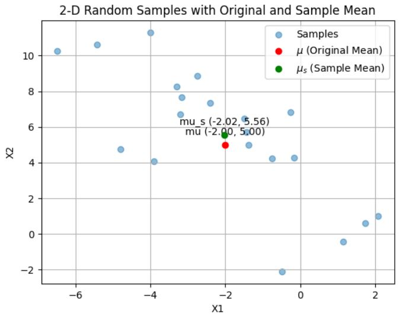

## 7. The Multivariate Gaussian Distribution

The multivariate Gaussian distribution extends the Gaussian distribution to more than one dimension.

Let us assume for simplicity that $( X $) consists of only 2 measurements: $( X = [x_1, x_2] $). A function of $( X $), $( f(X) $), assigns a value to each value of $( X $), that is each pair of $( x_1 $) and $( x_2 $).

To plot $( f(X) $), we need 3 axes: one for $( f $), one for $( x_1 $), and one for $( x_2 $).

```python
# Import libraries for plotting and random number generation
import matplotlib.pyplot as plt
from mpl_toolkits.mplot3d import Axes3D
import numpy as np

# Define mean and covariance matrix for a 2-D Gaussian distribution
mu = np.array([0, 0])
sigma = np.array([[1, 0.5], [0.5, 1]])

# Generate grid points
x1 = np.linspace(-3, 3, 100)
x2 = np.linspace(-3, 3, 100)
x1, x2 = np.meshgrid(x1, x2)

# Evaluate the Gaussian function at grid points
z = (1 / (2 * np.pi * np.sqrt(np.linalg.det(sigma)))) * \
    np.exp(-0.5 * (sigma[0, 0] * x1**2 + 2 * sigma[0, 1] * x1 * x2 + sigma[1, 1] * x2**2))

# Create a 3D plot
fig = plt.figure()
ax = fig.add_subplot(111, projection='3d')
ax.plot_surface(x1, x2, z, cmap='viridis')

# Labels and title
ax.set_xlabel('X1')
ax.set_ylabel('X2')
ax.set_zlabel('f(X)')
ax.set_title('Multivariate Gaussian Distribution')

plt.show()
```

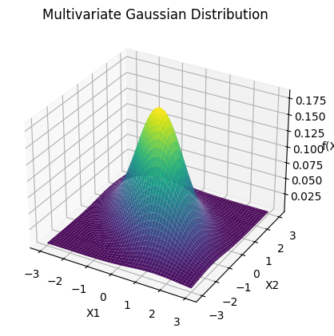


The Gaussian PDF in $( D $) dimensions is controlled by two parameters, $( \mu $) and $( \Sigma $).

For example, when $( D=2 $):
- \( \mu = [0, 0]^T \)
- \( \Sigma = \left[ \begin{array}{cc} 0.25 & 0.3 \\ 0.3 & 1 \end{array} \right] \)

To visualize this, a 3D plot can be created where the axes represent $( X_1 $), $( X_2 $), and $( f(X) $).

```python
# Import required libraries
import matplotlib.pyplot as plt
from mpl_toolkits.mplot3d import Axes3D
import numpy as np

# Define the mean and covariance matrix
mu = np.array([0, 0])
Sigma = np.array([[0.25, 0.3], [0.3, 1]])

# Create a grid of points
x, y = np.linspace(-3, 3, 100), np.linspace(-3, 3, 100)
x, y = np.meshgrid(x, y)

# Compute the Gaussian function values at the grid points
z = (1 / (2 * np.pi * np.sqrt(np.linalg.det(Sigma)))) * \
    np.exp(-0.5 * (Sigma[0, 0] * x**2 + 2 * Sigma[0, 1] * x * y + Sigma[1, 1] * y**2))

# Create a 3D plot
fig = plt.figure()
ax = fig.add_subplot(111, projection='3d')
ax.plot_surface(x, y, z, cmap='viridis')

# Labels and title
ax.set_xlabel('X1')
ax.set_ylabel('X2')
ax.set_zlabel('f(X)')
ax.set_title('2-D Gaussian Distribution')

plt.show()
```
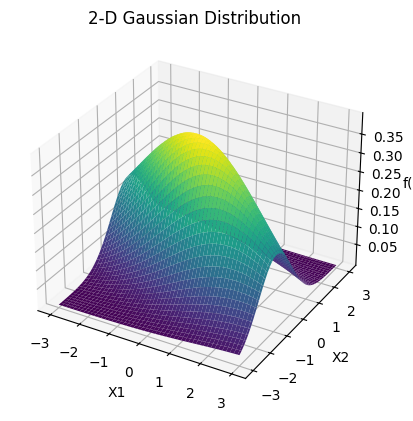

##### Sampling from a Multivariate Gaussian Distribution

Similarly to other distributions, it is possible to generate samples (sampling) also from a multivariate Gaussian distribution. 

For instance, a scatter plot of 10,000 2D Gaussian samples can be generated with:
- \( \mu = [0,0] \)
- \( \Sigma = \left[ \begin{array}{cc} 0.61 & 0.48 \\ 0.48 & 0.64 \end{array} \right] \)

A Python script can be used to generate these samples and visualize them on a scatter plot.

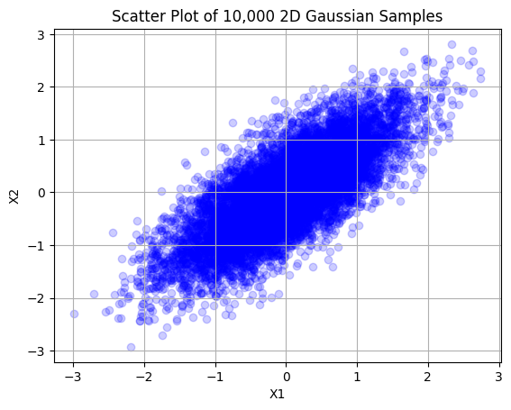

## 8.Fitting the lot: Parameter Estimation

Quick recap: so far, we have seen three types of probability distributions:

1. The categorical distribution
2. The Gaussian distribution
3. The multivariate Gaussian distribution

But how do we even fit them onto actual data?

Every distribution is fully identified by a set of parameters. For instance:

- In the case of the categorical distribution, the parameters are the probabilities of the values.
- In the case of the Gaussian distribution, they are the mean and the (co)variance.

We can denote these parameters as $( \theta $), and make them explicit in the probability distribution as $( p(x|\theta) $).

##### Parameter Estimation: Fitting a Probability Distribution

Let us assume that we are given a set of $( N $) samples of a random variable, $( x_i $), where $( i = 1, \ldots, N $).

We want to "fit" a probability distribution, $( p(x|\theta) $), onto them. This means choosing the parameters, $( \theta $), of that distribution in an optimal way.

To make the term "optimal" meaningful, we need to define an optimality criterion and find a way to satisfy it.

#### The Likelihood Function

If we have $( N $) samples $( x_i, i = 1 \ldots N $), we want to "fit" a probability distribution onto them. This means choosing $( \theta $) in an optimal way.

**What does "optimal" mean?**

We need an optimality criterion. The likelihood function is given by:

The likelihood function for $( N $) independent samples $( x_1, x_2, \ldots, x_N $) is given by:

\[
\mathcal{L}(\theta) = p(x_1|\theta) \cdot p(x_2|\theta) \cdot \ldots \cdot p(x_N|\theta) = \prod_{i=1}^{N} p(x_i|\theta)
\]

#### Maximum Likelihood Estimation (MLE)

A certain value of $( \theta $) may fit certain samples better than others. However, the goal is to maximize the likelihood function, requiring us to find a value "of compromise" for $( \theta $) such that the product of probabilities is maximized.

For instance, if $( \theta $) leads to a probability of 0 for any of the samples, the entire product of probabilities goes to zero, making it a bad choice for the parameter.

Therefore, the process of choosing the value of $( \theta $) that maximizes this product is known as Maximum-Likelihood Estimation (MLE).

##### Example: MLE for Gaussian

##### Training Set
The training set consists of 50 points generated from a Gaussian distribution with a mean of 0 and a standard deviation of 1.

##### MLE Parameters
The Maximum Likelihood Estimation (MLE) parameters for the Gaussian distribution are:
- **Mean** ($( \mu $)): 0.14
- **Standard Deviation** ($( \sigma $)): 1.13

#### Visualization
The histogram shows the distribution of the training data points, and the curve represents the Gaussian distribution with the MLE parameters.

```python
# Import necessary libraries
import numpy as np
import matplotlib.pyplot as plt
from scipy.stats import norm

# Generate a training set of 50 points from a Gaussian distribution with mean=0 and std=1
np.random.seed(0)  # for reproducibility
training_data = np.random.normal(0, 1, 50)

# Compute the MLE parameters (mean and std) for the Gaussian distribution
mle_mean = np.mean(training_data)
mle_std = np.std(training_data)

# Create subplots
fig, axs = plt.subplots(1, 1, figsize=(12, 6))

# Plot the histogram of the training data
plt.hist(training_data, bins=10, density=True, alpha=0.6, color='g', label="Training Data")

# Plot the MLE Gaussian curve
xmin, xmax = plt.xlim()
x = np.linspace(xmin, xmax, 100)
p = norm.pdf(x, mle_mean, mle_std)
plt.plot(x, p, 'k', linewidth=2, label=f"MLE Gaussian: mean={mle_mean:.2f}, std={mle_std:.2f}")

plt.title("MLE for Gaussian Distribution")
plt.xlabel("Data Points")
plt.ylabel("Density")
plt.legend()

# Show the plot
plt.show()
```
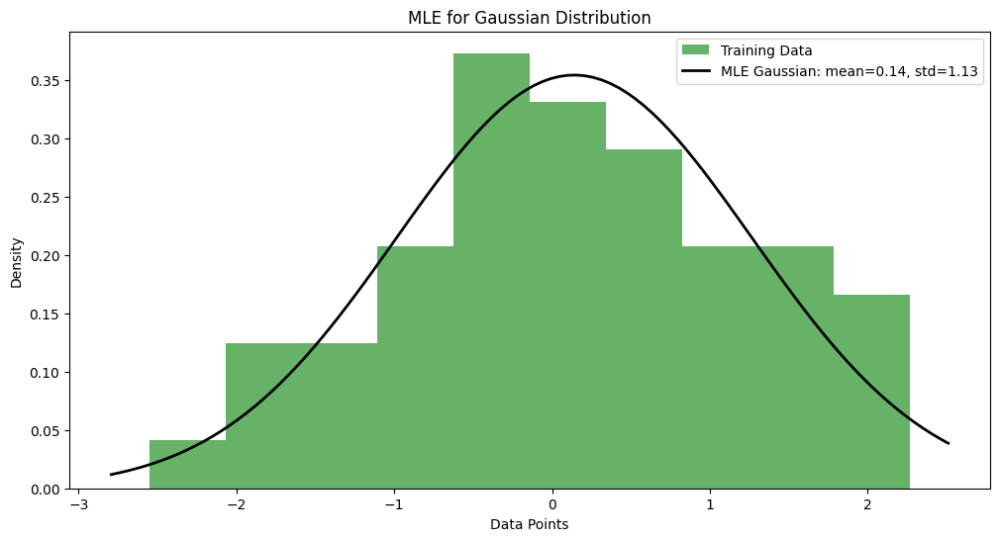

#### The Log-Likelihood

##### Warning!
The likelihood function is the product of many terms. For a categorical variable, these terms are always less than 1, and this is often the case for numerical variables as well. The product can easily reach a numerical zero.

**Why is this a problem?**  
If the likelihood function reaches zero, we can't distinguish between the best $( \theta $).

##### Solution: Log-Likelihood
To overcome this issue, we compute the likelihood in logarithmic scale. The formula for the log-likelihood is:

$[
\log \mathcal{L}(\theta) = \sum_{i=1}^{N} \log p(x_i | \theta)
$]

**Advantages:**  
If a factor was, say, 0.001, and the log is in base 10, it becomes a -3 addendum in the sum. This way, we are less likely to go out of the numerical range.

##### Key Property
Both the likelihood and the log-likelihood are maximized by the same $( \theta $).

#### MLE: Notable Examples

##### Categorical Variable with \(L\) Possible Values
- **Parameters:** $( \theta = \{ p_1, p_2, \ldots, p_L \} $)

Let's say we have observed $( N $) samples in total, $( n_1 $) of the first value, $( n_2 $) of the second, etc. Then the probabilities can be calculated as:

$[
p_1 = \frac{n_1}{N}, \quad p_2 = \frac{n_2}{N}, \quad \ldots, \quad p_L = \frac{n_L}{N}
$]

**Example:**  
Given 7 cars, 3 motorbikes, and 10 bicycles in total:
- $( p(\text{car}) = \frac{7}{20} = 0.35 $)
- $( p(\text{motorbike}) = \frac{3}{20} = 0.15 $)
- $( p(\text{bicycle}) = \frac{10}{20} = 0.50 $)

#### Gaussian Distribution
- **Parameters:** \( \theta = \{ \mu, \sigma^2 \} \)

Very simply, we set:
- $( \mu = \text{sample mean} $)
- $( \sigma^2 = \text{sample variance} $)

### Multivariate Gaussian Distribution
- **Parameters:** $( \theta = \{ \mu, \Sigma \} $)

For the multivariate Gaussian distribution, the MLE parameters are:
- $( \mu = \text{sample mean} $)
- $( \Sigma = \text{sample covariance} $)

**Note:**  
These choices maximize the likelihood function.

#### Other Cases: Beyond Closed-Form Solutions

In the cases of the categorical and Gaussian distributions, the MLE parameters can be computed in "closed form" (e.g., $( p_1 = \ldots $), $( \mu = \ldots $), etc.). However, not all distributions allow for such straightforward calculations.

#### Distributions Requiring Iterative Algorithms

For many other useful distributions, such as the Gamma distribution, the Student's $( t $)-distribution, etc., the MLE parameters (all or some) need to be determined with iterative algorithms.

#### Gaussian Mixture Model (GMM)

Another example includes the Gaussian Mixture Model (GMM), which is a probability distribution for multimodal data. A GMM is obtained by "mixing" multiple Gaussian distributions. The MLE parameters for a GMM are typically estimated using algorithms like the Expectation-Maximization (EM) algorithm.

**Note:**  
Iterative algorithms are often the only viable approach for maximizing the likelihood function in these more complex cases.


