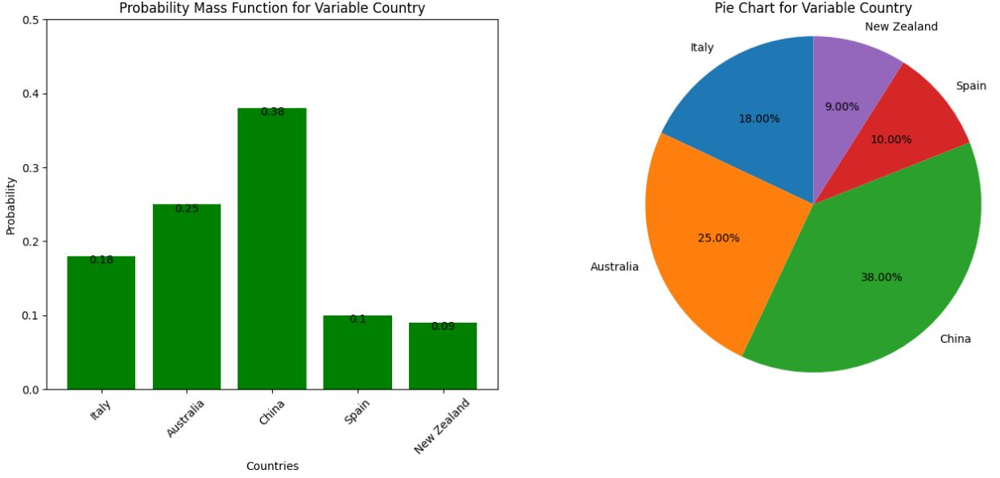
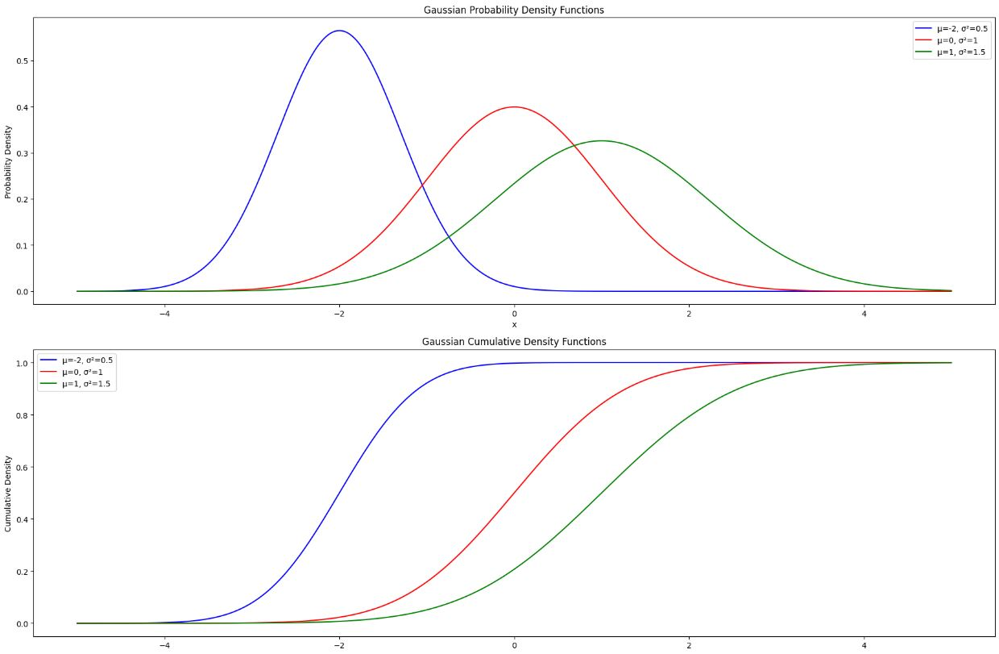

# Probability and Statistics Fundamentals

This repository is my notes on key concepts in probability and statistics, based on Prof. Massimo Piccardi's course Image Processing and Pattern Recognition 31256/42177. These principles are foundational for statistical pattern recognition and machine learning.

# Agenda

1. [Probability and statistics fundamentals: random variables and distributions](#i-probability-and-statistics-fundamentals-random-variables-and-distributions)
    1. [Random variables: categorical and numerical](#1-random-variables)
    2. [Mean and variance](#2-mean-and-variance)
    3. [Sample mean, sample covariance](#3-sample-mean-sample-covariance)
    4. [The Gaussian distribution](#4-the-gaussian-distribution)
    5. [Multivariate random variables](#5-multivariate-random-variables)
    6. [The covariance matrix](#6-covariance-matrix-or-covariance-of-a-multivariate-variable)
    7. [The multivariate Gaussian distribution](#7-the-multivariate-gaussian-distribution)
    8. [Fitting the lot: parameter estimation](#8fitting-the-lot-parameter-estimation)
  
2. [Fundamentals of classification](#ii-fundamentals-of-classification)
    1. [The linear model](#1-the-linear-model)
    2. [Multinomial logistic regression](#2-multinomial-logistic-regression)
    3. [Other popular classifiers](#3-other-popular-classifiers)
    4. [How to evaluate performance](#4-how-to-evaluate-performance)


# Probability and statistics fundamentals: random variables and distributions
# 1. Random Variables

- **Definition**: A variable whose outcome is determined by a random event.
- **Types**: Categorical (finite outcomes) and numerical (infinite outcomes).

## 1.1 Categorical Random Variables

- **Example**: 'Country' with five possible values: Italy, Australia, China, Spain, New Zealand.
- **Probabilities**:

| Country      | Probability |
| ------------ | ----------- |
| Italy        | 0.18        |
| Australia    | 0.25        |
| China        | 0.38        |
| Spain        | 0.10        |
| New Zealand  | 0.09        |

### Probability Mass Function (PMF)

- **Definition**: Maps each outcome of a discrete variable to its probability.
- **Properties**:
  - All probabilities are non-negative.
  - Sum of all probabilities is 1.

Example: Country PMF

- **Non-negative**: All listed probabilities are ≥ 0.
- **Sum to One**: \(0.18 + 0.25 + 0.38 + 0.10 + 0.09 = 1\)

[Notebook with Plots](./src/chapter1/probability_mass_function_country.ipynb)

```python
# Import libraries
import matplotlib.pyplot as plt
import numpy as np

# Initialize data
countries = ['Italy', 'Australia', 'China', 'Spain', 'New Zealand']
probabilities = [0.18, 0.25, 0.38, 0.10, 0.09]

# Create figure and subplots
fig, axs = plt.subplots(1, 2, figsize=(16, 6))

# Bar chart: PMF
axs[0].bar(countries, probabilities, color='green')
axs[0].set(xlabel='Countries', ylabel='Probability', title='Country PMF')
axs[0].set_xticklabels(countries, rotation=45)
axs[0].set_ylim([0, 0.5])

# Pie chart: Probabilities
axs[1].pie(probabilities, labels=countries, autopct='%1.2f%%', startangle=90)
axs[1].set_title('Country Probability Pie Chart')
axs[1].axis('equal')

# Show plots
plt.show()
```



## 1.2 Numerical Random Variables

- **Definition**: A variable whose outcomes can take any number in a range.
- **Types**: Continuous (infinite outcomes in an interval) and discrete (countable outcomes).
  
Examples

- **Continuous**: Height of a person, weight of a person, intensity of a pixel in an image.
- **Discrete**: Number of employees in a company, scores on a test.

### Probability Density Function (PDF)

- **Definition**: The function assigning a probability value to each of the numerical values. The pdf of a continuous random variable, p(x), (if it exists) gives us the density of probability in x

- **Properties**: 
  - $( p(x) \geq 0 $) for all $( x $)
  - The area under the curve is 1.

Notation

- $( p(x) $) denotes the probability density of any value of $( x $).

```python
import matplotlib.pyplot as plt
import numpy as np
from scipy.stats import norm

# Generate the x values: from -2 to 2 in steps of 0.1
x = np.arange(-2, 2.1, 0.1)

# Compute the pdf of a normal distribution with mean 0 and std 0.25
pdf_values = norm.pdf(x, 0, 0.25)

# Create the plot
plt.plot(x, pdf_values)
plt.title('Gaussian PDF with mean 0 and std 0.25')
plt.xlabel('x')
plt.ylabel('pdf(x)')
plt.show()
```


The so-called “random” numbers differ in their probability distributions!. for example: 

Gaussian Distribution: The plot shows 100 samples from a Gaussian distribution with mean 0 and standard deviation 2. You can see the classic "bell curve" shape.

```python
# Generate 100 samples from a Gaussian (Normal) distribution with mean 0 and standard deviation 2
X_normal = np.random.normal(0, 2, (100, 1))

# Create subplots
fig, axs = plt.subplots(1, 1, figsize=(18, 6))

# Plot Gaussian distribution
plt.hist(X_normal, bins=20, color='blue', edgecolor='black', alpha=0.7)
plt.title('Gaussian Distribution')  # Updated this line
plt.xlabel('x')  # Updated this line
plt.ylabel('Frequency')  # Updated this line

# Show plots
plt.show()
```


Uniform Distribution: The plot shows 100 samples from a uniform distribution between 0 and 2. The frequency of each bin should be roughly equal, given that the distribution is uniform.

```python
X_uniform = np.random.uniform(0, 2, (100, 1))

# Plot Uniform distribution
plt.hist(X_uniform, bins=20, color='green', edgecolor='black', alpha=0.7)
plt.title('Uniform Distribution')
plt.xlabel('x')
plt.ylabel('Frequency')

# Show plots
plt.show()
```


Student's t-Distribution: The third plot shows 100 samples from a Student's t-distribution with 1.5 degrees of freedom, a location of 0, and a scale of 2. The distribution is somewhat similar to the Gaussian distribution but has heavier tails.

```python
df = 1.5  # degrees of freedom
loc = 0  # location
scale = 2  # scale

X_t = t.rvs(df, loc, scale, size=(100, 1))

# Plot Student's t-distribution
plt.hist(X_t, bins=20, color='red', edgecolor='black', alpha=0.7)
plt.title("Student's t-Distribution")
plt.xlabel('x')
plt.ylabel('Frequency')

# Show plots
plt.show()
```


## 2. Mean and Variance
The pdf of a continuous random variable describes its probability distribution fully. However, sometimes it's more convenient to summarize the distribution using a few key statistics:


##### Mean
The mean ($( \mu $)) is the weighted average value of the random variable, where the weights are given by the probability density function (pdf). 

##### Variance
The Variance ($( \sigma^2 $)) quantifies the “dispersion” of the values around the mean.

##### Standard Deviation
The standard deviation ($( \sigma $)) is just its square root and is in the same scale as the random variables values.

These summary statistics can be computed exactly using integrals.


##### Approximating Mean and Variance

Often, the probability density function $( p(x) $) may not be available or the integrals required for exact calculations are not easy to compute. In such cases, it's common to approximate the statistical properties using a set of samples.

Assuming a set of samples $( x_i $), where $( i = 1, 2, \ldots, N $) are available, we can approximate the mean $( \mu $) and the variance $( \sigma^2 $) as follows:

###### Approximating the Mean

The mean $( \mu $) can be approximated as the average of the samples:

$[
\mu \approx \frac{1}{N} \sum_{i=1}^{N} x_i
$]

###### Approximating the Variance

The variance $( \sigma^2 $) can be approximated as:

$[
\sigma^2 \approx \frac{1}{N} \sum_{i=1}^{N} (x_i - \mu)^2
$]

Here, $( \mu $) is the approximated mean as calculated above.

#### 3. Sample mean, sample covariance
```python
import numpy as np
import matplotlib.pyplot as plt

# Generate 20 random samples from a standard normal distribution (mean=0, std=1)
X = np.random.randn(20, 1)

# Plot the samples on the screen
plt.plot(X, np.ones(20), 'o')
plt.xlabel('Sample Value')
plt.ylabel('Y=1')
plt.title('Random Samples Plot')
plt.show()

# Compute the sample mean
mu = np.mean(X)

# Compute the sample variance
sigma_2 = np.var(X)

# Compute the standard deviation
sigma = np.sqrt(sigma_2)

print(f"Sample mean: {mu}")
print(f"Sample variance: {sigma_2}")
print(f"Standard deviation: {sigma}")

```


## 4. The Gaussian Distribution

The Gaussian distribution, also known as the normal distribution, has many favorable properties that make it a popular choice for data modeling in various fields including statistics, finance, and machine learning.

#### Analytical Form of the PDF

The Probability Density Function (PDF) of the Gaussian distribution is given by the following formula:

$[
p(x) = \frac{1}{\sigma \sqrt{2 \pi}} e^{-\frac{1}{2} \left(\frac{x - \mu}{\sigma}\right)^2}
$]

Here, the distribution is completely determined by two parameters:
- $( \mu $): The mean of the distribution
- $( \sigma^2 $): The variance of the distribution

The mean $( \mu $) indicates where the peak of the distribution occurs, and the variance $( \sigma^2 $) indicates the spread or width of the distribution.

## 5. Multivariate Random Variables

Often, we encounter situations where multiple random variables are associated with the same object. In such cases, it becomes convenient to consider these variables together as a single set. This set is referred to as a **random vector** or **multivariate random variable**, depending on the context.


Examples could include:

- The dimensions of an object, represented as (length, width, depth).
- The pixels of an image, represented as (pixel1, pixel2, ..., pixelN).
- The color channels of a pixel, represented as (R, G, B).


We can denote the individual variables as $( x_i $), where $( i = 1, 2, ..., D $), and the entire multivariate random variable can be represented as $( \mathbf{X} = [x_1, x_2, ..., x_D]^T $).


Therefore, the probability of all these variables, $( p(x_1, x_2, ..., x_D) $), can be noted more compactly as $( p(\mathbf{X}) $).


The next section will discuss what happens to the mean and variance when dealing with multivariate random variables.

#### Mean of a Multivariate Variable

The mean of a multivariate variable is an extension of the concept of the mean of a single variable.


Given $( D $) individual variables, the mean of each individual variable is calculated. These means are then "packed together" into a $( D \times 1 $) vector.

$[
\mu = [\mu_1, \mu_2, ..., \mu_D]^T
$]

In this notation, $( \mu $) is the vector that contains the means of each individual variable $( x_i $) for $( i = 1, 2, ..., D $).

## 6. Covariance Matrix or (Co)variance of a Multivariate Variable

The concept of variance extends to multivariate random variables but becomes more intricate.

Recall that variance measures the "dispersion" of values around the mean for a univariate random variable. In the multivariate setting, we are interested in how each pair of individual variables co-varies around their means.

For a multivariate variable with $( D $) individual variables, the covariance is represented as a $( D \times D $) matrix.

$[
\text{Cov}(\mathbf{X}) = \begin{pmatrix}
\text{cov}(x_1, x_1) & \text{cov}(x_1, x_2) & \cdots & \text{cov}(x_1, x_D) \\
\text{cov}(x_2, x_1) & \text{cov}(x_2, x_2) & \cdots & \text{cov}(x_2, x_D) \\
\vdots & \vdots & \ddots & \vdots \\
\text{cov}(x_D, x_1) & \text{cov}(x_D, x_2) & \cdots & \text{cov}(x_D, x_D)
\end{pmatrix}
$]

Each entry $( \text{cov}(x_i, x_j) $) measures how much $( x_i $) and $( x_j $) co-vary around their means.

##### Sample Mean and Sample Covariance for Multivariate Variables

For multivariate variables with $(D$) dimensions and $(N$) samples, both the sample mean and sample covariance can be calculated.

The sample mean is a <span style="color:red">$(D \times 1$)</span> vector given by:

\[
\mu = \frac{1}{N} \sum_{i=1}^{N} \mathbf{x}_i
\]


The sample covariance is a <span style="color:red">$(D \times D$)</span> matrix, and it's defined as:

\[
\Sigma = \frac{1}{N} \sum_{i=1}^{N} (\mathbf{x}_i - \mu)(\mathbf{x}_i - \mu)^T
\]

Note that the covariance matrix is <span style="color:red">$(D \times D$)</span> in size, arising from the product of a <span style="color:red">$(D \times 1$)</span> vector and its transpose, a $(1 \times D$) vector.


##### The Expanded Form of Sample Covariance

To understand sample covariance more deeply, it's useful to look at its expanded form.

The expanded formula for the sample covariance matrix $( \Sigma $) is:

\[
\begin{aligned}
\Sigma &=  \left[ 
    \begin{array}{c}
        \frac{1}{N} \sum_{i=1}^{N}(x_{i1} - \mu_1)^2 & \cdots & \frac{1}{N} \sum_{i=1}^{N}(x_{i1} - \mu_1)(x_{iD} - \mu_D) \\
        \frac{1}{N} \sum_{i=1}^{N}(x_{iD} - \mu_D)(x_{i1} - \mu_1) & \cdots & \frac{1}{N} \sum_{i=1}^{N} (x_{iD} - \mu_D)^2
    \end{array}
\right]
\end{aligned}
\]

As you can observe, the covariance matrix is always symmetric. That is:

\[
\text{cov}(x_i, x_j) = \text{cov}(x_j, x_i)
\]

Example
```python
import numpy as np
import matplotlib.pyplot as plt

# Define mean and covariance matrix
mu = np.array([-2, 5])
sigma = np.array([[4, -3], [-3, 8]])

# Generate 20 2-D random samples
X = np.random.multivariate_normal(mu, sigma, 20)

# Scatter plot for the samples
plt.scatter(X[:, 0], X[:, 1], label='Samples', alpha=0.5)

# Compute sample mean and sample covariance matrix
mu_s = np.mean(X, axis=0)
sigma_s = np.cov(X, rowvar=False)

# Add markers for mu and mu_s
plt.scatter(mu[0], mu[1], color='red', zorder=5, label='$\\mu$ (Original Mean)')
plt.scatter(mu_s[0], mu_s[1], color='green', zorder=5, label='$\\mu_s$ (Sample Mean)')

# Annotate the points for better visibility
plt.annotate(f"mu ({mu[0]:.2f}, {mu[1]:.2f})", (mu[0], mu[1]), textcoords="offset points", xytext=(0,10), ha='center')
plt.annotate(f"mu_s ({mu_s[0]:.2f}, {mu_s[1]:.2f})", (mu_s[0], mu_s[1]), textcoords="offset points", xytext=(0,10), ha='center')

# Labels and title
plt.xlabel('X1')
plt.ylabel('X2')
plt.title('2-D Random Samples with Original and Sample Mean')
plt.legend()
plt.grid(True)

# Show the plot
plt.show()
```


## 7. The Multivariate Gaussian Distribution

The multivariate Gaussian distribution extends the Gaussian distribution to more than one dimension.

Let us assume for simplicity that $( X $) consists of only 2 measurements: $( X = [x_1, x_2] $). A function of $( X $), $( f(X) $), assigns a value to each value of $( X $), that is each pair of $( x_1 $) and $( x_2 $).

To plot $( f(X) $), we need 3 axes: one for $( f $), one for $( x_1 $), and one for $( x_2 $).

```python
# Import libraries for plotting and random number generation
import matplotlib.pyplot as plt
from mpl_toolkits.mplot3d import Axes3D
import numpy as np

# Define mean and covariance matrix for a 2-D Gaussian distribution
mu = np.array([0, 0])
sigma = np.array([[1, 0.5], [0.5, 1]])

# Generate grid points
x1 = np.linspace(-3, 3, 100)
x2 = np.linspace(-3, 3, 100)
x1, x2 = np.meshgrid(x1, x2)

# Evaluate the Gaussian function at grid points
z = (1 / (2 * np.pi * np.sqrt(np.linalg.det(sigma)))) * \
    np.exp(-0.5 * (sigma[0, 0] * x1**2 + 2 * sigma[0, 1] * x1 * x2 + sigma[1, 1] * x2**2))

# Create a 3D plot
fig = plt.figure()
ax = fig.add_subplot(111, projection='3d')
ax.plot_surface(x1, x2, z, cmap='viridis')

# Labels and title
ax.set_xlabel('X1')
ax.set_ylabel('X2')
ax.set_zlabel('f(X)')
ax.set_title('Multivariate Gaussian Distribution')

plt.show()
```


The Gaussian PDF in $( D $) dimensions is controlled by two parameters, $( \mu $) and $( \Sigma $).

For example, when $( D=2 $):
- \( \mu = [0, 0]^T \)
- \( \Sigma = \left[ \begin{array}{cc} 0.25 & 0.3 \\ 0.3 & 1 \end{array} \right] \)

To visualize this, a 3D plot can be created where the axes represent $( X_1 $), $( X_2 $), and $( f(X) $).

```python
# Import required libraries
import matplotlib.pyplot as plt
from mpl_toolkits.mplot3d import Axes3D
import numpy as np

# Define the mean and covariance matrix
mu = np.array([0, 0])
Sigma = np.array([[0.25, 0.3], [0.3, 1]])

# Create a grid of points
x, y = np.linspace(-3, 3, 100), np.linspace(-3, 3, 100)
x, y = np.meshgrid(x, y)

# Compute the Gaussian function values at the grid points
z = (1 / (2 * np.pi * np.sqrt(np.linalg.det(Sigma)))) * \
    np.exp(-0.5 * (Sigma[0, 0] * x**2 + 2 * Sigma[0, 1] * x * y + Sigma[1, 1] * y**2))

# Create a 3D plot
fig = plt.figure()
ax = fig.add_subplot(111, projection='3d')
ax.plot_surface(x, y, z, cmap='viridis')

# Labels and title
ax.set_xlabel('X1')
ax.set_ylabel('X2')
ax.set_zlabel('f(X)')
ax.set_title('2-D Gaussian Distribution')

plt.show()
```


##### Sampling from a Multivariate Gaussian Distribution

Similarly to other distributions, it is possible to generate samples (sampling) also from a multivariate Gaussian distribution. 

For instance, a scatter plot of 10,000 2D Gaussian samples can be generated with:
- \( \mu = [0,0] \)
- \( \Sigma = \left[ \begin{array}{cc} 0.61 & 0.48 \\ 0.48 & 0.64 \end{array} \right] \)

A Python script can be used to generate these samples and visualize them on a scatter plot.


## 8.Fitting the lot: Parameter Estimation

Quick recap: so far, we have seen three types of probability distributions:

1. The categorical distribution
2. The Gaussian distribution
3. The multivariate Gaussian distribution

But how do we even fit them onto actual data?

Every distribution is fully identified by a set of parameters. For instance:

- In the case of the categorical distribution, the parameters are the probabilities of the values.
- In the case of the Gaussian distribution, they are the mean and the (co)variance.

We can denote these parameters as $( \theta $), and make them explicit in the probability distribution as $( p(x|\theta) $).

##### Parameter Estimation: Fitting a Probability Distribution

Let us assume that we are given a set of $( N $) samples of a random variable, $( x_i $), where $( i = 1, \ldots, N $).

We want to "fit" a probability distribution, $( p(x|\theta) $), onto them. This means choosing the parameters, $( \theta $), of that distribution in an optimal way.

To make the term "optimal" meaningful, we need to define an optimality criterion and find a way to satisfy it.

#### The Likelihood Function

If we have $( N $) samples $( x_i, i = 1 \ldots N $), we want to "fit" a probability distribution onto them. This means choosing $( \theta $) in an optimal way.

**What does "optimal" mean?**

We need an optimality criterion. The likelihood function is given by:

The likelihood function for $( N $) independent samples $( x_1, x_2, \ldots, x_N $) is given by:

\[
\mathcal{L}(\theta) = p(x_1|\theta) \cdot p(x_2|\theta) \cdot \ldots \cdot p(x_N|\theta) = \prod_{i=1}^{N} p(x_i|\theta)
\]

#### Maximum Likelihood Estimation (MLE)

A certain value of $( \theta $) may fit certain samples better than others. However, the goal is to maximize the likelihood function, requiring us to find a value "of compromise" for $( \theta $) such that the product of probabilities is maximized.

For instance, if $( \theta $) leads to a probability of 0 for any of the samples, the entire product of probabilities goes to zero, making it a bad choice for the parameter.

Therefore, the process of choosing the value of $( \theta $) that maximizes this product is known as Maximum-Likelihood Estimation (MLE).

##### Example: MLE for Gaussian

##### Training Set
The training set consists of 50 points generated from a Gaussian distribution with a mean of 0 and a standard deviation of 1.

##### MLE Parameters
The Maximum Likelihood Estimation (MLE) parameters for the Gaussian distribution are:
- **Mean** ($( \mu $)): 0.14
- **Standard Deviation** ($( \sigma $)): 1.13

#### Visualization
The histogram shows the distribution of the training data points, and the curve represents the Gaussian distribution with the MLE parameters.

```python
# Import necessary libraries
import numpy as np
import matplotlib.pyplot as plt
from scipy.stats import norm

# Generate a training set of 50 points from a Gaussian distribution with mean=0 and std=1
np.random.seed(0)  # for reproducibility
training_data = np.random.normal(0, 1, 50)

# Compute the MLE parameters (mean and std) for the Gaussian distribution
mle_mean = np.mean(training_data)
mle_std = np.std(training_data)

# Create subplots
fig, axs = plt.subplots(1, 1, figsize=(12, 6))

# Plot the histogram of the training data
plt.hist(training_data, bins=10, density=True, alpha=0.6, color='g', label="Training Data")

# Plot the MLE Gaussian curve
xmin, xmax = plt.xlim()
x = np.linspace(xmin, xmax, 100)
p = norm.pdf(x, mle_mean, mle_std)
plt.plot(x, p, 'k', linewidth=2, label=f"MLE Gaussian: mean={mle_mean:.2f}, std={mle_std:.2f}")

plt.title("MLE for Gaussian Distribution")
plt.xlabel("Data Points")
plt.ylabel("Density")
plt.legend()

# Show the plot
plt.show()
```


#### The Log-Likelihood

##### Warning!
The likelihood function is the product of many terms. For a categorical variable, these terms are always less than 1, and this is often the case for numerical variables as well. The product can easily reach a numerical zero.

**Why is this a problem?**  
If the likelihood function reaches zero, we can't distinguish between the best $( \theta $).

##### Solution: Log-Likelihood
To overcome this issue, we compute the likelihood in logarithmic scale. The formula for the log-likelihood is:

$[
\log \mathcal{L}(\theta) = \sum_{i=1}^{N} \log p(x_i | \theta)
$]

**Advantages:**  
If a factor was, say, 0.001, and the log is in base 10, it becomes a -3 addendum in the sum. This way, we are less likely to go out of the numerical range.

##### Key Property
Both the likelihood and the log-likelihood are maximized by the same $( \theta $).

#### MLE: Notable Examples

##### Categorical Variable with \(L\) Possible Values
- **Parameters:** $( \theta = \{ p_1, p_2, \ldots, p_L \} $)

Let's say we have observed $( N $) samples in total, $( n_1 $) of the first value, $( n_2 $) of the second, etc. Then the probabilities can be calculated as:

$[
p_1 = \frac{n_1}{N}, \quad p_2 = \frac{n_2}{N}, \quad \ldots, \quad p_L = \frac{n_L}{N}
$]

**Example:**  
Given 7 cars, 3 motorbikes, and 10 bicycles in total:
- $( p(\text{car}) = \frac{7}{20} = 0.35 $)
- $( p(\text{motorbike}) = \frac{3}{20} = 0.15 $)
- $( p(\text{bicycle}) = \frac{10}{20} = 0.50 $)

#### Gaussian Distribution
- **Parameters:** \( \theta = \{ \mu, \sigma^2 \} \)

Very simply, we set:
- $( \mu = \text{sample mean} $)
- $( \sigma^2 = \text{sample variance} $)

### Multivariate Gaussian Distribution
- **Parameters:** $( \theta = \{ \mu, \Sigma \} $)

For the multivariate Gaussian distribution, the MLE parameters are:
- $( \mu = \text{sample mean} $)
- $( \Sigma = \text{sample covariance} $)

**Note:**  
These choices maximize the likelihood function.

#### Other Cases: Beyond Closed-Form Solutions

In the cases of the categorical and Gaussian distributions, the MLE parameters can be computed in "closed form" (e.g., $( p_1 = \ldots $), $( \mu = \ldots $), etc.). However, not all distributions allow for such straightforward calculations.

#### Distributions Requiring Iterative Algorithms

For many other useful distributions, such as the Gamma distribution, the Student's $( t $)-distribution, etc., the MLE parameters (all or some) need to be determined with iterative algorithms.

#### Gaussian Mixture Model (GMM)

Another example includes the Gaussian Mixture Model (GMM), which is a probability distribution for multimodal data. A GMM is obtained by "mixing" multiple Gaussian distributions. The MLE parameters for a GMM are typically estimated using algorithms like the Expectation-Maximization (EM) algorithm.

**Note:**  
Iterative algorithms are often the only viable approach for maximizing the likelihood function in these more complex cases.

# Fundamentals of classification
Classification is performed by first acquiring a measurement of the object and then applying a classification algorithm. Assuming the existence of M distinct classes (categories). The act of categorising the object to a specific class is termed as classification.


The class \( y \) can take <span style="color:red">catgorical</span> values e.g., \{ "cat", "dog", "bird", "stand", "run", "land", "water", "road" \}. In the context of image and video data, **the measurement** is typically represented as a <span style="color:red"> numerical vector</span>.


**The score function**
For a particular  measurement \( \mathbf{x} \), a classification algorithm calculates a score \( s \) for each possible class label \( y \). Consider a scenario with three classes:


A higher score indicates greater "compatibility" between the measurement \( \mathbf{x} \) and the corresponding class \( y \). Subsequently, the measurement \( \mathbf{x} \) is allocated to the class with the highest score.

**Probabilistic classifiers**
In a probabilistic classifier, the scores, also known as probability of class y given input x \( p(y|\mathbf{x}) \). The scores satisfy:
\[
\sum_{y \in \mathcal{Y}} p(y|\mathbf{x}) = 1, \quad 0 \leq p(y|\mathbf{x}) \leq 1
\]


All deep learning classifiers (eg. CNNs) are probabilistic , outputting probabilities \( p(y|\mathbf{x}) \) for each class \( y \) given the measurement \( \mathbf{x} \).

**Measurement**
The feature vector \( \mathbf{x} \) can be derived from various characteristics of the image or video, such as:

- Pixels intensity 
- Filter Output
- Spatial gradients between adjacent pixels
- Histogram representations of the aforementioned attributes

Regardless of the source, \( \mathbf{x} \) can be conceptualised as a **large numerical vector**:

\[
\mathbf{x} = [ 2.2, 0.5, -1.7, \ldots, 321.4, 0.0, 9.6 ]^T
\]

## The linear model
We proceed to explicitly define the conditional probability \( p(y|\mathbf{x}) \). We commence with the most elementary model, which is the linear model.
In a linear model, each class is identified by a **vector of weights**, \( \mathbf{w} \), <u>having the same size as the measurement</u>, \( \mathbf{x} \).
An additional number, \( b \), known as the bias or offset, may also be incorporated.

The vectors and bias are as follows:
\[
 \mathbf{w} = \begin{pmatrix} 2 \\ -1.2 \\ 0.6 \end{pmatrix}   \mathbf{x} =\begin{pmatrix} 2.4 \\ 3.5 \\ 1 \end{pmatrix}  b = -12.3
\]

#### The score of the linear model

The ***score*** in the linear model is computed by taking the standard dot product of the weight vector \( \mathbf{w} \) and the measurement \( \mathbf{x} \), and then adding the bias term \( b \):

\[
\text{score} = \mathbf{w}^T \mathbf{x} + b
\]

\( \mathbf{w} \): parameters for the class
\( \mathbf{x} \): measurement (input). 

NB: The dot product is the usual matrix product between two vectors of equal size: multiply each pair of elements, and add all the products up


**Example Score of the Linear Model**

Suppose you're in a grocery store, and you're trying to classify fruits based on their color and weight. Here's how the variables would map to this scenario:

- \( \mathbf{w} \) (weight vector) could represent the importance of color and weight in identifying each type of fruit (apple, avocado, pear).
- \( \mathbf{x} \) (measurement) would contain the color and weight values for a specific fruit you're looking at.
- \( b \) (bias) might include other considerations, such as ripeness or seasonal availability.

The "score" is like an indicator of how closely the examined fruit matches each type (apple, avocado, pear).

**Example with a 3D Measurement**

Let's say you have a fruit with these measurements: \( \mathbf{x} = [2.4, 3.5, 1]^T \) (e.g., redness=2.4, roundness=3.5, weight=1). The weight vector \( \mathbf{w} \) could be \( [2, -1.2, 0.6]^T \), which might indicate the importance of these measurements for identifying it as an apple, for instance.

A score of \( -11.1 \) could imply that the fruit is unlikely to be an apple, based on the characteristics that \( \mathbf{w} \) represents.

**Example with 3 Classes: Apple, Avocado, Pear**

Here, each fruit type has its own weight vector:

- \( \mathbf{w1} = [3, -4]^T \) could be for apples, emphasizing high color and low roundness.
- \( \mathbf{w2} = [5, 5]^T \) could be for avocados, where color and roundness are both high.
- \( \mathbf{w3} = [-1, -2]^T \) could be for pears, where these measurements are less crucial or inversely related to identification.

This code calculates the class scores for a given fruit based on its characteristics, helping you determine whether it's most likely an apple, an avocado, or a pear.

```python 
import numpy as np

# Define the measurement vector x
# x contains the color and weight measurements for a specific fruit
# For example, x could be [5, -2] where 5 represents the color and -2 represents the weight
x = np.array([5, -2])  # 2 x 1 array

# Define the weight matrices for the three classes (apple, avocado, pear)
# Each column in w represents the weight vector for one class
# For instance, w1 = [3, -4] could represent the apple class
# Here, 3 and -4 indicate the importance of color and weight, respectively, for being an apple
w = np.array([[3, -4], [5, 5], [-1, -2]]).T  # 2 x 3 array

# Calculate w' * x to get the scores for each class
# The scores will indicate how closely the fruit in question matches each of the three classes
result = np.dot(w.T, x)  # Should be a 3 x 1 array

# Print the result
# For example, if the output is [23, 15, -1], it suggests the fruit is most likely an apple,
# less likely an avocado, and least likely to be a pear.
print(result)
```

The problem with the score of the linear model is that it is unbounded. (Is a score of 3 "high"? Or 300? Is -10 "low"?)
It would be better to normalise the score as a probability, so that we are ensured that 1 is the best possible score and 0 is the lowest. To achieve this goal, we employ the exponential function. 

**The exponential function**
The exponential function has the advantage of taking inputs from the entire real number line and mapping them to positive values only. 


For each class \( k \), we first apply the exponential function to the linear model score \( w_k^T x + b_k \):

\[
\text{exp\_score} = e^{(w_k^T x + b_k)}
\]

Then, to normalize these exponential scores into probabilities, we sum up the exponential scores for all \( M \) classes and divide each class's exponential score by this sum:

\[
\text{normalized\_score}_k = \frac{e^{(w_k^T x + b_k)}}{\sum_{m=1}^{M} e^{(w_m^T x + b_m)}}
\]

This way, each \( \text{normalized\_score}_k \) will be a probability bounded between 0 and 1.

## The multinomial logistic regression classifier

The (multinomial) logistic regression classifier has this expression:


**The key properties**

1. The score is non-negative: 
\[
\text{normalized\_score}_k \geq 0 \quad (\text{since } e^x \geq 0)
\]

2. The score is bounded by 1:
\[
0 \leq \text{normalized\_score}_k \leq 1 \quad (\text{as numerator is part of denominator } )
\]

3. The sum of the scores for all \( M \) classes is 1:
\[
\sum_{k=1}^{M} \text{normalized\_score}_k = 1
\]

These properties confirm that the normalized scores function as probabilities.

**Example**

You're still at the local farmers' market, where a fruit-sorting machine is tasked with classifying fruits into three categories: apple, avocado, and pear. The machine uses two factors to classify each fruit:

1. Color (measured on an arbitrary scale where higher numbers indicate redder hues)
2. Roundness (measured similarly, where negative numbers indicate more elongated shapes)

- Number of Classes (\( M \)): 3 (Apple, Avocado, Pear)
- Measurement Dimensions (\( D \)): 2 (Color and Roundness)
- Measurement Vector (\( x \)): \([5, -2]^T\) (Quite red but not very round)

The machine has been trained with the following weight vectors:

- Apple (\( w_1 \)): \([3, -4]^T\) (Prioritizes redness but not roundness, which might be a little counterintuitive for apples but let's go with it for the sake of the example)
- Avocado (\( w_2 \)): \([5, 5]^T\) (Does not prioritize redness but looks for roundness)
- Pear (\( w_3 \)): \([-1, -2]^T\) (Neither redness nor roundness is important)

<u> The Machine's Calculations </u>
The machine computes the dot product of each weight vector with the measurement vector:

- \( w_1^T x = 23 \) (High score, likely an apple under this model)
- \( w_2^T x = 15 \) (Medium score)
- \( w_3^T x = -1 \) (Low score, unlikely a pear)

Then, it converts these scores into probabilities:

- \( p(y=1|x) = \frac{e^{23}}{e^{23} + e^{15} + e^{-1}} = 0.997 \) (Very likely to be an apple)
- \( p(y=2|x) = \frac{e^{15}}{e^{23} + e^{15} + e^{-1}} = 0.003 \) (Very unlikely to be an avocado)
- \( p(y=3|x) = \frac{e^{-1}}{e^{23} + e^{15} + e^{-1}} = 0.000 \) (Almost certainly not a pear)

The machine is 99.7% confident that the fruit is an apple, based on its model. It sorts the fruit into the "Apple" bin, making you ponder the increasing role of AI in our daily lives.

```python 
import numpy as np

# Define the measurement vector x for a specific fruit.
# In this example, the fruit is quite red (5) but not very round (-2).
x = np.array([5, -2])  # 2 x 1 array

# Define the weight matrix w for the three fruit classes (Apple, Avocado, Pear).
# Each column in w represents the weight vector for one class.
w = np.array([[3, -4], [5, 5], [-1, -2]]).T  # 2 x 3 array

# Calculate the denominator for the probability formulas.
# This is the sum of the exponentials of the dot products of the weight vectors and the measurement vector.
denominator = np.sum(np.exp(np.dot(w.T, x)))  # Scalar value

# Calculate the probabilities for each class.
# This is done by taking the exponential of the dot product for each class and dividing by the denominator.
p = np.exp(np.dot(w.T, x)) / denominator  # 3 x 1 array

print(p)
```
## Softmax
This operator is not exclusive to simple models; it's also employed in deep learning architectures. Known as the softmax function, it generalizes the linear model by replacing the logits \( w_k^T x \) with more complex, nonlinear functions denoted as \( f(w_k, x) \) in deep networks.


## Training a probabilistic classifier
Every classifier, logistic regression included, comes with a set of trainable parameters. Before deploying the classifier for predictions, we need to fit its parameters over a set of data, a step known as training. The dataset used for this purpose is called training set, often denoted as \( (x_i, y_i), i = 1, \ldots, N \).
To effectively adjust these parameters on the training set, an objective metric, commonly referred to as a "loss function," is required.

The ultimate objective is to train the classifier so that it can classify all instances in the training dataset accurately. However, mere accuracy on the training data is not sufficient to ensure effective performance on new, unseen data. Ideally, we want the classifier to assign the correct classes <span style="color:red">the highest score possible </span>, optimally a 1. Consequently, this would result in the incorrect classes receiving scores as close to 0 as possible.

## The negative log-likelihood (NLL) aka cross entropy

For both theoretical and pratical considerations, it's more appropriate to optimise the **log** of the probabilities rather than the probabilities themselves. The loss function that we aim to minimize is given by:

\[
\text{Loss} = -\sum_{i=1}^{N} \ln p(y_i|x_i)
\]

This is the Negative Log-Likelihood (NLL), also known as Cross Entropy (at times, XENT). The range of this function is from 0 (best) to \( +\infty \) (worst).

**Example**
This is what a plot of the NLL would look like during the training of your classifier:

The performance on a data set other than the training set (the "validation" set) won't improve past a point.

## Overfitting
At times fitting the models “too tightly” on the training set leads to poor prediction of new data (“overfitting”). This often happens when the model has many parameters and the training set is too small


Ideally, we would like our classifier to learn the black boundary, but if it has too many parameters, it may learn the green one. In field, the accuracy may be low.

## Regularisation

When you can't add more training dataset or simplifying the classifier by reducing its parameters, regularisation often serves as an effective mitigation strategy. Regularisation modifies the Negative Log-Likelihood (NLL) training objective in various ways:

-  **L2 Regularization**: This method keeps the model parameters **small** to prevent overfitting.
-  **L1 Regularization**: This approach aims to make the model parameters **sparse**, encouraging many of them to be zero.
-  **Dropout**: During each training iteration, this technique randomly sets a subset of parameters to zero to improve generalization.
-  **Label Smoothing**: This is incorporated into the training objective to make the model more robust to label noise.

# Performance evaluation of classifiers 
Let's delve into the metrics used to assess a classifier's effectiveness, commonly referred to as "accuracy." These metrics can vary depending on the application and have historical roots in various fields, including signal processing, information retrieval, and medicine, among others. We will outline the key metrics in the subsequent discussion.

## Binary classification
Let's begin by focusing on binary classification, a scenario where only two distinct classes exist. In such cases, the classes typically represent the presence or absence of a certain attribute. These classes are occasionally referred to as the two hypotheses and are denoted as \( H1 \) and \( H0 \). A binary classification task is also commonly known as a detector.

## Binary classification test
Consistently with the concept of a test, samples can be partitioned based on their actual labels into:
1. Positives (P)
2. Negatives (N)

After classification, based on both the **ground-truth** and **assigned** labels, the same samples can be categorised as:
1. True Positives (TP)
2. True Negatives (TN)
3. False Positives (FP)
4. False Negatives (FN)

Here, "True" signifies that the label was correctly assigned, while "False" indicates an incorrect assignment. Naturally, achieving <span style="color:red">TP</span> and <span style="color:red">TN</span> is favorable, while encountering FP and FN is undesirable.

## Contingency table

Using symbols P, N, TP, TN, FP, FN to mean the corresponding numbers, the <span style="color:red"> contingency table </span> for the binary classification test is:


|       Tr/Pr         | \( H0 \) (False Hypothesis) | \( H1 \) (True Hypothesis)  |
|---------------------|-----------------------------|-----------------------------|
| \( H0 \)            | True Negatives (TN)         | False Positives (FP)        |
| \( H1 \)            | False Negatives (FN)        | True Positives (TP)         |

- The total number of samples \( = P + N = TP + TN + FP + FN \)
    - This equation says that the sum of all the samples is the sum of True Positives, True Negatives, False Positives, and False Negatives.
  
- \( P = TP + FN \)
    - This equation states that the total number of positive samples is the sum of True Positives and False Negatives.
  
- \( N = TN + FP \)
    - This equation means that the total number of negative samples is the sum of True Negatives and False Positives.

The table and these equations together provide a comprehensive view of how well the binary classification test performs when distinguishing between \( H0 \) and \( H1 \).

## Accuracy

The fundamental measure of the performance of a classifier is the accuracy, often expressed as a percentage (e.g., 80%)

\[
\text{Accuracy} = \frac{{TP + TN}}{{P + N}}
\]

The error rate (e.g., 20%), which is the complement to accuracy, can be calculated as:

\[
\text{Error Rate} = 1 - \text{Accuracy} = \frac{{FP + FN}}{{P + N}}
\]

**Accuracy: shortcomings**

Accuracy can be highly misleading as a performance metric when dealing with imbalanced datasets, which is often the case. Specifically, when there is a significant skew between the "negative" (or class "0") and "positive" (or class "1") samples. For example, consider a hypothetical dataset related to "scams" that includes only 5 positive instances (actual scams) and 995 negative instances (legitimate transactions). In such cases, relying solely on accuracy may not provide a comprehensive view of the classifier's effectiveness.


In such scenarios, a naive classifier that consistently predicts "negative" would yield an accuracy of \( \frac{995}{1000} = 99.5\% \). While this may seem impressive, it's highly misleading as it fails to capture any of the actual "positives" we are most concerned about. A more insightful approach is to assess the performance ***separetly*** for the two classes, taking into account their respective ***sizes***.

## Detection rate and false alarm rate
Within the signal processing community, two frequently employed metrics are:
- The Detection Rate (DR), defined as \( \frac{{TP}}{{P}} = \frac{{TP}}{{TP + FN}} \)
- The False Alarm Rate (FAR), calculated as \( \frac{{FP}}{{N}} = \frac{{FP}}{{FP + TN}} \)

The objective is to maximize the Detection Rate (DR) while minimizing the False Alarm Rate (FAR).


## Precision, recall and F1 score
Alternatively, the metrics of precision and recall can be employed:
- Precision (\( p \)) is defined as \( \frac{{TP}}{{TP + FP}} \)
- Recall (\( r \)) is synonymous with the detection rate

These two can be compounded into a single metric known as the F1 score (or F-score, or F-measure) , given by \( \frac{{2pr}}{{p + r}} \).

Note: In medical testing, terms like **sensitivity** (equivalent to DR) and **specificity** (equivalent to \( 1 - \text{FAR} \)) are often used.

Additional Terminology: False Positives are also known as Type 1 or alpha errors, while False Negatives are referred to as Type 2 or beta errors.

**Binary classification test: example**
Dr. Lilly, a neuroscientist focused on Alzheimer's research, conducts a preliminary trial on 100 brain tissue samples for a groundbreaking drug she has developed.

She finds that the drug effectively reversed Alzheimer's symptoms in 90 out of 100 samples. Using the formula:

\[
\text{Accuracy} = \frac{TP + TN}{P + N} = \frac{90}{100} = 90\%
\]

Lilly is encouraged but mindful that Alzheimer's is a complex disease requiring further investigation.

She calculates the error rate:

\[
\text{Error Rate} = 1 - \text{Accuracy} = \frac{10}{100} = 10\%
\]

Next, she assesses the False Alarm Rate (FAR):

\[
\text{FAR} = \frac{FP}{TN + FP} = \frac{8}{88} \approx 9\%
\]

Her main concern is the Detection Rate (DR):

\[
\text{DR} = \frac{TP}{TP + FN} = \frac{10}{12} \approx 83\%
\]

She then calculates the drug's precision \( p \):

\[
p = \frac{TP}{TP + FP} = \frac{10}{18} \approx 56\%
\]

Finally, she evaluates the F1 score:

\[
\text{F1 score} = 2 \times \frac{p \times DR}{p + DR} \approx 67\%
\]

**Note**: The F1 score is notably different from the initial 90% accuracy, underscoring the need for a multi-faceted evaluation.

**Contingency Table**

|       Tr/Pr         | \( H0 \) | \( H1 \)  |
|---------------------|-----------|-----------|
| \( H0 \)            | 80        | 8         |
| \( H1 \)            | 2         | 10        |


With these insights, Dr. Lilly is more motivated than ever to head back to her lab and refine her drug. She aims to develop it into a reliable cure for Alzheimer's, a disease that impacts not just patients, but entire families.

## Receiver operating characteristic (ROC) and Area under the precision-recall curve (AUC)

Frequently, a classifier's performance can be adjusted to improve the Detection Rate (DR) at the cost of increasing the False Alarm Rate (FAR), or the other way around. The graphical representation of various (FAR, DR) combinations is termed a Receiver Operating Characteristic (ROC) curve. The integral of this curve, commonly referred to as the Area Under the ROC Curve (AUC-ROC), serves as an overall performance metric. Note that a higher AUC-ROC value is preferable, with 1 being the optimal score.

### ROC (receiver operating characteristic)

To further refine her understanding of the Alzheimer's drug, Lilly examines the Receiver Operating Characteristic (ROC) curve. This curve plots the False Alarm Rate (FAR) against the Detection Rate (DR), expressed as:

\[
\text{FAR} = \frac{FP}{TN + FP} \quad \text{and} \quad \text{DR} = \frac{TP}{TP + FN}
\]


**Figure**: The ROC curve offers a nuanced look at the Alzheimer's drug's performance. A curve that leans towards the upper left corner is indicative of superior classification performance.

To summarize the ROC curve into a single performance metric, Lilly calculates the Area Under the ROC Curve (AUC-ROC):

\[
\text{AUC-ROC} = \int_{0}^{1} \text{ROC curve}
\]

The closer this number is to 1, the more promising the drug appears to be.
Not stopping at the ROC curve, Lilly also evaluates the Precision-Recall (P-R) curve. This curve is defined by:

### AUC: area under the precision-recall curve

A comparable curve can be constructed using precision and recall values. The area beneath this curve is commonly referred to as "AUC," although the term "AUPRC" (Area Under the Precision-Recall Curve) is sometimes used to eliminate any ambiguity.

The precision and recall are used to evaluate the performance of classification models. Precision focuses on the positive predictions made by the model, whereas Recall (or Sensitivity or True Positive Rate) focuses on the proportion of actual positive cases that were correctly identified.


\[
\text{Precision} = \frac{TP}{TP + FP} \quad \text{and} \quad \text{Recall} = \frac{TP}{TP + FN}
\]


**Figure**: The graph depicts the P-R curves for two different algorithms. Higher values for both Precision and Recall signify a more effective Alzheimer's drug.

Finally, Lilly considers the Area Under the Precision-Recall Curve (AUPRC), calculated as:

\[
\text{AUPRC} = \int_{0}^{1} \text{P-R curve}
\]

Similar to AUC-ROC, a higher AUPRC value is indicative of better drug performance.

## Multiple classes

In multi-class classification scenarios, the confusion matrix becomes the go-to tool for performance evaluation. Consider a case with four distinct classes:

\[
\begin{array}{|c|c|c|c|c|}
\hline
  & C1 & C2 & C3 & C4 \\
\hline
C1 & 7 & 0 & 3 & 0 \\
\hline
C2 & 2 & 30 & 2 & 6 \\
\hline
C3 & 0 & 0 & 34 & 6 \\
\hline
C4 & 0 & 0 & 0 & 35 \\
\hline
\end{array}
\]

Metrics like accuracy and error rate can be naturally extended to this context. For more specific metrics, calculations can be focused on a per-class basis.

For example, the accuracy can be computed as:

\[
\text{Accuracy} = \frac{TP_1 + TP_2 + TP_3 + TP_4}{\text{Total Samples}}
\]

And for Class 1, Precision can be calculated as:

\[
\text{Precision (Class 1)} = \frac{TP_1}{TP_1 + FP_{21} + FP_{31} + FP_{41}}
\]

## Training vs test sets

Classifiers require a trainin **stage**, in which the model's parameters are fine-tuned using a specific collection of examples, known as the training set. Assessing the model's performance using this same set would yield an inflated accuracy estimate. Therefore, it's crucial to separate the available samples into a training set and a different test set—for example, a 66%-34% split, although the proportion is not strictly defined. The accuracy determined on this test set is commonly referred to as the holdout accuracy.

## N-fold cross validation

Performing multiple iterations and averaging the holdout accuracy <u>without altering the hyperparameters</u>, can yield more realistic  estimates that are less dependent on the particular training and test sets used. In the technique of N-fold cross-validation, the dataset is partitioned into N subsets. Training is conducted on N-1 of these subsets, while the remaining one serves as the test set. This process is repeated N times, each time with a different test set, and the accuracies are then averaged. For instance, if N is set to 10:


**Example**

```python 
from sklearn.model_selection import cross_val_score
from sklearn.datasets import make_classification
from sklearn.svm import SVC
import numpy as np

# Create synthetic data: 100 samples, 2 features, 2 classes (Husky=1, Wolf=0)
X, y = make_classification(n_samples=100, n_features=2, n_informative=2, n_redundant=0, n_classes=2, random_state=1)

# Create an SVM classifier
clf = SVC(kernel='linear')

# Perform 10-fold cross-validation
cv_scores = cross_val_score(clf, X, y, cv=10)

# Calculate the mean and standard deviation of the cross-validation scores
mean_cv_score = np.mean(cv_scores)
std_cv_score = np.std(cv_scores)

mean_cv_score, std_cv_score

```
In this example, a 10-fold cross-validation is performed using a Support Vector Machine (SVM) classifier on a synthetic dataset with 100 samples and 2 features. The dataset is divided into 10 "slices." For each fold, 9 slices are used for training and 1 for testing. The average accuracy across all 10 folds is approximately 97%, with a standard deviation of about 6.4%. This process provides a more robust measure of the model's performance.​

## The hyperparameters
Each model consists of two types of parameters:
1. **Normal parameters**, which can be fine-tuned automatically by minimizing a loss function.
2. **Hyperparameters**, which are not subject to automatic optimisation and must be configured manually. After setting these, one needs to evaluate the model's performance using the loss function or another evaluation metric to identify the optimal settings.

This process necessitates a division of the data into training, validation, and test sets.

Example:
Certainly, let's consider a medical example where we are trying to predict whether a tumor is malignant or benign based on various medical test results.

***Dataset***
Suppose you have a dataset of 1000 medical records, each with features like tumor size, age of the patient, blood test results, etc., and labels indicating whether the tumor is malignant (1) or benign (0).

***Normal Parameters***
In the context of a Decision Tree Classifier, the questions like "Is tumor size > 5 cm?" or "Is the patient's age > 50?" are the normal parameters. These are learned automatically from the training data to minimize the Gini impurity or entropy.

***Hyperparameters***
Before training, you might have to set several hyperparameters for the Decision Tree such as:
- `max_depth`: The maximum depth of the tree, say 5.
- `min_samples_split`: The minimum number of samples required to split a node, say 10.

These hyperparameters are not learned from the data but are set prior to the training process.

***Dataset Division***
To train and evaluate the model, you would typically divide your 1000 records into:
- Training set: 700 records to train the model
- Validation set: 150 records to tune hyperparameters
- Test set: 150 records to evaluate the model

After training the model on the 700-record training set, you would use the validation set to tune your hyperparameters. For example, you might try `max_depth` values of 3, 5, and 7, and `min_samples_split` values of 5, 10, and 20, then pick the combination that yields the best performance on the validation set.

Finally, you would evaluate the model's generalization performance on the test set, which it has never seen before. This process ensures that the model is well-tuned for the specific medical prediction task and generalizes well to new, unseen data.

## Other popular classifiers
There's no single classifier that universally outperforms all others across every dataset. However, certain classifiers are generally noted for their strong performance, including:
- Deep learning models like Convolutional Neural Networks (CNN) and Recurrent Neural Networks (RNN)
- Support Vector Machines (SVM)
- k-Nearest Neighbors (k-NN)
- Decision Trees and Random Forests
- Boosting techniques such as XGBoost and AdaBoost


**The support vector machine**
In the context of distinguishing between 2 classes Huskies and Wolves, the Support Vector Machine (SVM) will aim to identify a decision boundary that is as far removed as possible from the nearest Husky and the nearest Wolf. This ensures that the classification model has the maximum margin of error, improving its ability to correctly classify future data points as either a Husky or a Wolf.
[download here](./src/chapter2/svm.ipynb)

```python
from sklearn import svm
import matplotlib.pyplot as plt
import numpy as np

# Synthetic dataset: [weight, height]
# Huskies are represented by 1 and Wolves by 0
X = np.array([[40, 22], [38, 20], [35, 24], [50, 28], [54, 30]])  # feature set
y = np.array([1, 1, 1, 0, 0])  # labels: 1 for Husky, 0 for Wolf

# Create a Support Vector Machine classifier
clf = svm.SVC(kernel='linear', C=1)

# Fit the classifier
clf.fit(X, y)

# Create a mesh grid for plotting
xx, yy = np.meshgrid(np.linspace(X[:, 0].min() - 1, X[:, 0].max() + 1, 100),
                     np.linspace(X[:, 1].min() - 1, X[:, 1].max() + 1, 100))

# Predict each point in the mesh grid
Z = clf.predict(np.c_[xx.ravel(), yy.ravel()])
Z = Z.reshape(xx.shape)

# Plot the decision boundary and the data points
plt.contourf(xx, yy, Z, alpha=0.8)
plt.scatter(X[:, 0], X[:, 1], c=y, edgecolors='k', marker='o', s=100)
plt.xlabel('Weight')
plt.ylabel('Height')
plt.title('SVM Decision Boundary')

# Highlight the support vectors
plt.scatter(clf.support_vectors_[:, 0], clf.support_vectors_[:, 1], s=100, facecolors='none', edgecolors='k', marker='o')

plt.show()

```

The SVM model with a linear kernel is trained to find the optimal decision boundary that separates Huskies from Wolves based on features like weight and height. The decision boundary is visualized along with the data points to show how well the model separates the two classes.

**k-nearest neighbours**
Let's consider the same example where we want to classify animals as either "Husky" or "Wolf" based on two features: weight and height. The k-Nearest Neighbors (k-NN) algorithm doesn't require any training in the traditional sense. It simply stores the training dataset and makes decisions based on the majority class among the k-nearest neighbors of the sample point in the feature space.
[download here](./src/chapter2/k-nearest-neighbours.ipynb)

```python
# Importing necessary libraries
import matplotlib.pyplot as plt
import numpy as np

# Huskies' features: weight, height
huskies = np.array([[40, 22], [38, 20], [35, 24]])

# Wolves' features: weight, height
wolves = np.array([[50, 28], [54, 30]])

# New animal's features: weight, height
new_animal = np.array([45, 25])

# Plotting the Huskies
plt.scatter(huskies[:, 0], huskies[:, 1], c='blue', label='Huskies')

# Plotting the Wolves
plt.scatter(wolves[:, 0], wolves[:, 1], c='red', label='Wolves')

# Plotting the new animal
plt.scatter(new_animal[0], new_animal[1], c='green', marker='x', label='New Animal (Unknown)')

# Adding labels and title
plt.xlabel('Weight')
plt.ylabel('Height')
plt.title('k-NN Classification Example')
plt.legend()
plt.grid(True)

plt.show()
```


- The Blue points represent Huskies
- Red points represent Wolves
- The green 'x' represents the new animal that we want to classify
- The x-axis represents the weight of the animals, and the y-axis represents their height.

In this k-NN example, the algorithm would look at the 3 nearest neighbors of the green 'x' to classify it as either a Husky or a Wolf.​

**Decision Trees**
Decision trees generally evaluate a single attribute in each step. While this approach may not yield the most efficient decision boundaries, it has the advantage of being easier for humans to understand. This method is particularly well-suited for scenarios with fewer features.
[download here](./src/chapter2/decision-trees.ipynb)

```python
# Importing required libraries for plotting and decision tree classifier
from sklearn.tree import DecisionTreeClassifier, plot_tree
import numpy as np
import matplotlib.pyplot as plt

# Create a synthetic dataset: [weight, height]
# Huskies are represented by 1 and Wolves by 0
X_train = np.array([[40, 22], [38, 20], [35, 24], [50, 28], [54, 30]])  # feature set
y_train = np.array([1, 1, 1, 0, 0])  # labels: 1 for Husky, 0 for Wolf

# Create and train a Decision Tree classifier
clf = DecisionTreeClassifier(random_state=0)
clf.fit(X_train, y_train)

# Plot the decision tree
plt.figure(figsize=(12, 8))
plot_tree(clf, filled=True, feature_names=["Weight", "Height"], class_names=["Wolf", "Husky"])
plt.show()
```


The decision tree serves to differentiate between a Husky and a Wolf by examining their weight and height. It starts by inquiring if the animal's height is 26 or less. Depending on whether the answer is "yes" or "no," the tree proceeds to ask additional questions along its branches, culminating in a leaf node that provides the ultimate categorisation.

**XGBoost**

XGBoost is a software library which provides a gradient boosting framework for various programming languages. Gradient boosting is a classification approach which makes a model out of an ensemble of weak classifiers, typically decision trees, built sequentially.


```python
# Importing necessary libraries for the example
from xgboost import XGBClassifier
import numpy as np
from sklearn.model_selection import train_test_split
from sklearn.metrics import accuracy_score

# Creating a synthetic dataset for the Husky and Wolf example
# [weight, height]
# Huskies are represented by 1 and Wolves by 0
X = np.array([[40, 22], [38, 20], [35, 24], [50, 28], [54, 30], [52, 29], [48, 31], [41, 23], [39, 21], [36, 25]])  # feature set
y = np.array([1, 1, 1, 0, 0, 0, 0, 1, 1, 1])  # labels: 1 for Husky, 0 for Wolf

# Splitting the dataset into training and testing sets
X_train, X_test, y_train, y_test = train_test_split(X, y, test_size=0.2, random_state=42)

# Instantiate XGBoost classifier
xgb_clf = XGBClassifier()

# Fitting the model to the training data
xgb_clf.fit(X_train, y_train)

# Predicting the labels for the test set
y_pred = xgb_clf.predict(X_test)

# Calculating the accuracy of the model
accuracy = accuracy_score(y_test, y_pred)
print(f'Accuracy: {accuracy * 100:.2f}%')

```
