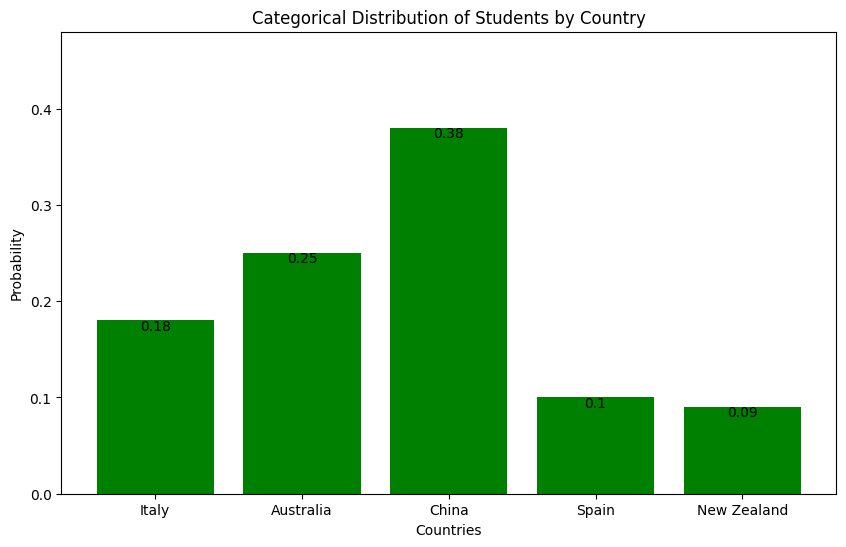

## The Multinational University Problem: A Data Specialist's Dilemma

### Context
You're a Data Specialist for a multinational chain of private universities. The director is planning to standardize facilities across campuses worldwide. To do this effectively, you need to understand the characteristics of students, such as their heights, for ordering appropriately sized desks and lecture hall seating.

### The Problem
How can you leverage the principles of probability and statistics to understand student characteristics like height, age, and country of origin, so that the director can make informed decisions about facility standardization?

## Analysis Journey: From Data to Decision

##### Definition
- **Height, Age, Country**: These are your random variables, the outcomes of which are determined by random events like birth, genetics, and location.

##### Types
- **Country of Origin**: Categorical random variable
- **Height and Age**: Numerical random variables (Continuous)

### 1. Categorical Random Variables
We will start by analyzing student nationality as a starting point that provides valuable cultural and logistical insights that can be specific to different countries.

The table represents the probabilities of students coming from different countries in a sample university. The "Probability" column is expressed as a percentage of the total student population.

**Country**: The country of origin of the students.
**Probability**: The probability of a student being from each country, expressed as a percentage relative to the total student population.

| Country       | Probability   |
|---------------|---------------|
| Italy         | 0.18          |
| Australia     | 0.25          |
| China         | 0.38          |
| Spain         | 0.10          |
| New Zealand   | 0.09          |


- **Mathematical Representation**: For a categorical variable \( X \) that can take on values \( x_1, x_2, \ldots, x_k \) with probabilities \( p_1, p_2, \ldots, p_k \) respectively, the distribution is defined as:
  \[
  P(X = x_i) = p_i, \quad \text{where} \quad \sum_{i=1}^{k} p_i = 1
  \]

#### Probability Mass Function (PMF):
 A PMF is a function that gives the probability of each possible outcome for a discrete random variable. It is applicable to both categorical and numerical discrete variables.


**Non-negative**: All listed probabilities are ≥ 0.
**Sum to one**: \(0.18 + 0.25 + 0.38 + 0.10 + 0.09 = 1\)

```python
# Data: Country proportions
countries = ['Italy', 'Australia', 'China', 'Spain', 'New Zealand']
probabilities = [0.18, 0.25, 0.38, 0.10, 0.09]
```


  
### 2. Numerical Random Variables
We'll now concentrate solely on the heights of students, setting aside all other characteristics. Student height is a continuous numerical random variable, ranging within a specific interval, such as between 0 cm and 280 cm.

```python
# Generate 20 random samples of heights (assuming heights are normally distributed)
heights = np.random.normal(170, 10, 20)  # mean=170cm, std=10cm

# Compute the sample mean and variance
mean_height = np.mean(heights)
variance_height = np.var(heights)
```

##### Gaussian Distribution (For Height)
- Mathematical Equations:
  \[
  \text{Mean: } \mu = \frac{1}{N} \sum_{i=1}^{N} x_i
  \]
  \[
  \text{Variance: } \sigma^2 = \frac{1}{N} \sum_{i=1}^{N} (x_i - \mu)^2
  \]

---

### Step 3: Probability Distributions

- You'd use the Gaussian distribution to model heights and ages, considering they're continuous variables.

**Python Example: Gaussian PDF for Heights**
```python
# Generate the height values: from 140 to 200 in steps of 1
x = np.arange(140, 200, 1)

# Compute the pdf of a normal distribution with mean 170 and std 10
pdf_values = norm.pdf(x, 170, 10)
```
*Plotting this would give you a curve that can help you understand the height distribution.*

##### Gaussian Distribution
- Mathematical Equation for PDF:
  \[
  f(x | \mu, \sigma^2) = \frac{1}{\sqrt{2 \pi \sigma^2}} \exp\left(-\frac{(x - \mu)^2}{2 \sigma^2}\right)
  \]

---

### Step 4: Multivariate Analysis

- Consider using a multivariate Gaussian distribution when you want to understand the relationship between height and age.

**Python Example: 2-D Gaussian for Height and Age**
```python
# Define mean and covariance matrix for a 2-D Gaussian distribution
mu = np.array([170, 22])  # mean height = 170 cm, mean age = 22 years
sigma = np.array([[10, 0.5], [0.5, 1]])  # Covariance matrix
```

##### Multivariate Gaussian Distribution
- Mathematical Equation for PDF:
  \[
  f(\mathbf{x} | \boldsymbol{\mu}, \boldsymbol{\Sigma}) = \frac{1}{\sqrt{(2\pi)^k |\boldsymbol{\Sigma}|}} \exp\left(-\frac{1}{2} (\mathbf{x} - \boldsymbol{\mu})^\top \boldsymbol{\Sigma}^{-1} (\mathbf{x} - \boldsymbol{\mu})\right)
  \]

---

### Step 5: Fitting the Model: Maximum Likelihood Estimation (MLE)

- Fit a Gaussian distribution to your data to find the MLE of the mean and variance for height and age. This would give you the most "likely" parameters based on your data.

**Python Example: MLE for Height**
```python
# Assuming you've collected height data
mle_mean_height = np.mean(height_data)
mle_variance_height = np.var(height_data)
```

---

### Step 6: Decision Making

- With these analyses, you can now give the director statistically sound advice on the standard sizes for desks and lecture hall seating based on student heights and ages.

---
